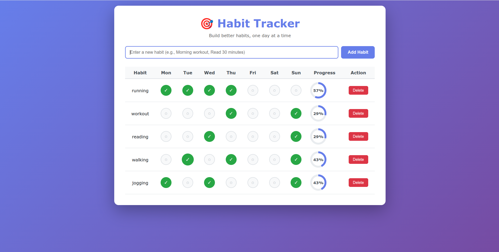

# 🎯 PHP Habit Tracker

A simple, elegant habit tracking application built with pure PHP. Track your daily habits with a beautiful interface and persistent JSON storage.





## ✨ Features

- ✅ Add and delete habits
- ✅ Track completion for each day of the week
- ✅ Visual progress indicators
- ✅ Persistent storage using JSON files
- ✅ Responsive design
- ✅ No database required
- ✅ Modern, clean UI

## 🚀 Quick Start

### Prerequisites

- PHP 7.4 or higher
- A web browser
- Terminal/Command Prompt

### Installation

1. **Clone or download this repository**
```bash
git clone https://github.com/yourusername/php-habit-tracker.git
cd php-habit-tracker
```

2. **Verify PHP is installed**
```bash
php -v
```

If PHP is not installed, see [Installation Guide](#installation-guide) below.

3. **Start the PHP development server**
```bash
php -S localhost:8000
```

4. **Open your browser**
Navigate to: `http://localhost:8000`

That's it! 🎉

## 📖 Installation Guide

### macOS

```bash
# Install Homebrew (if not already installed)
/bin/bash -c "$(curl -fsSL https://raw.githubusercontent.com/Homebrew/install/HEAD/install.sh)"

# Install PHP
brew install php
```

### Ubuntu/Debian

```bash
sudo apt update
sudo apt install php php-cli php-json
```

### Windows

1. Download PHP from [windows.php.net/download](https://windows.php.net/download/)
2. Extract to `C:\php`
3. Add `C:\php` to your system PATH
4. Restart your terminal

**Or use XAMPP:**
1. Download from [apachefriends.org](https://www.apachefriends.org/)
2. Install and start Apache
3. Place files in `htdocs` folder
4. Access via `http://localhost/habit-tracker/`

## 📁 Project Structure

```
php-habit-tracker/
├── index.php          # Main application file
├── data.json          # Habit data (auto-created)
├── README.md          # This file
├── TOOLKIT.md         # Complete learning documentation
└── .gitignore         # Git ignore file
```

## 🎮 Usage

### Adding a Habit

1. Type your habit name in the input field (e.g., "Morning workout")
2. Click "Add Habit"
3. Your habit appears in the table

### Tracking Progress

1. Click the circular buttons under each day
2. ✓ = Completed (green)
3. ○ = Not completed (gray)
4. Progress percentage updates automatically

### Deleting a Habit

1. Click the "Delete" button on the habit row
2. Habit is permanently removed

## 🛠️ How It Works

### Data Storage

The application uses a simple JSON file (`data.json`) to store habit data:

```json
[
  {
    "id": 1,
    "name": "Morning workout",
    "days": {
      "Monday": true,
      "Tuesday": false,
      "Wednesday": true,
      "Thursday": false,
      "Friday": true,
      "Saturday": false,
      "Sunday": true
    },
    "created_at": "2025-11-26 10:30:00"
  }
]
```

### Key Functions

- `loadHabits()` - Reads habits from JSON file
- `saveHabits()` - Writes habits to JSON file
- `addHabit()` - Creates a new habit
- `toggleDay()` - Marks a day as complete/incomplete
- `deleteHabit()` - Removes a habit
- `getCompletionPercentage()` - Calculates progress

## 🔧 Troubleshooting

### Blank Page?

Enable error reporting by adding to `index.php`:
```php
<?php
error_reporting(E_ALL);
ini_set('display_errors', 1);
?>
```

### Permission Denied?

Make sure the directory is writable:
```bash
chmod 755 /path/to/project
```

### Port Already in Use?

Try a different port:
```bash
php -S localhost:8080
```

### Data Not Saving?

Check if `data.json` can be created:
```bash
touch data.json
chmod 644 data.json
```

## 🎓 Learning Resources

This project is part of the **Moringa AI Capstone Project**. For complete learning documentation including:

- AI prompts used
- Step-by-step learning process
- Common errors and solutions
- Reference materials

See [TOOLKIT.md](TOOLKIT.md) for the full guide.

## 🤝 Contributing

This is a learning project, but suggestions are welcome!

1. Fork the repository
2. Create a feature branch
3. Commit your changes
4. Push to the branch
5. Open a Pull Request

## 📝 License

MIT License - feel free to use this project for learning purposes.

## 👨‍💻 Author

**Esther Muthoni Irungu**
