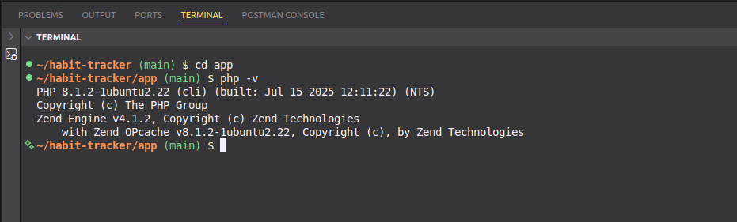
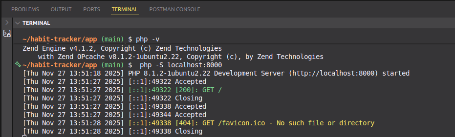

# 🛠️ PHP Habit Tracker Toolkit Document

## 1. Title & Objective

**Title:** PHP Habit Tracker

**Objective:** Create a simple habit tracker using plain PHP.

* Technology: PHP
* Reason: Lightweight, easy to run locally, simple file-based storage.
* End goal: Render a web UI that tracks habits with weekly progress.

## 2. Quick Summary of the Technology

**PHP:** Server-side scripting language used for web development.

* Used for: Building dynamic web pages, handling forms, storing and retrieving data.
* Real-world example: WordPress (43% of all websites), Facebook (originally built with PHP), Wikipedia, Slack's backend.

## 3. System Requirements

* OS: Linux/Mac/Windows
* Tools: VS Code or any code editor
* PHP CLI installed (version 8.x recommended)
* Web browser

## 4. Installation & Setup Instructions

1. Ensure PHP is installed: `php -v`



2. Navigate to project folder: `cd habit-tracker/app`
3. Run built-in PHP server: `php -S localhost:8000`


 
4. Open browser at `http://localhost:8000`

## 5. Minimal Working Example

### What This Example Does
- Displays a form to add new habits
- Shows a table with weekly checkboxes (Mon-Sun)
- Calculates completion percentages
- Allows toggling and deleting habits

### Key Code Snippets

#### 1. Loading Data from JSON
```php
<?php
// Load existing habits from JSON file
$dataFile = __DIR__ . '/data.json';
$habits = file_exists($dataFile) 
    ? json_decode(file_get_contents($dataFile), true) ?? []
    : [];
?>
```

#### 2. Adding a New Habit
```php
if (isset($_POST['add']) && !empty(trim($_POST['name']))) {
    $habits[] = [
        'id' => uniqid(),                    // Unique ID
        'name' => trim($_POST['name']),      // Habit name
        'days' => array_fill(0, 7, false)    // 7 empty days
    ];
    file_put_contents($dataFile, json_encode($habits, JSON_PRETTY_PRINT));
}
```

#### 3. Toggling Day Completion
```php
if (isset($_POST['toggle'])) {
    foreach ($habits as &$habit) {
        if ($habit['id'] === $_POST['habit_id']) {
            $dayIndex = (int)$_POST['day'];
            $habit['days'][$dayIndex] = !$habit['days'][$dayIndex]; // Flip
            break;
        }
    }
    file_put_contents($dataFile, json_encode($habits, JSON_PRETTY_PRINT));
}
```

#### 4. Calculating Progress
```php
function getCompletionPercentage($days) {
    $completed = count(array_filter($days));  // Count true values
    return round(($completed / count($days)) * 100);
}
```

#### 5. Displaying a Habit Row
```php
<?php foreach ($habits as $habit): ?>
    <tr>
        <td><?= htmlspecialchars($habit['name']) ?></td>
        
        <!-- Day buttons -->
        <?php foreach ($habit['days'] as $dayIndex => $completed): ?>
            <td>
                <form method="POST">
                    <input type="hidden" name="habit_id" value="<?= $habit['id'] ?>">
                    <input type="hidden" name="day" value="<?= $dayIndex ?>">
                    <button name="toggle" class="<?= $completed ? 'completed' : '' ?>">
                        <?= $completed ? '✓' : '○' ?>
                    </button>
                </form>
            </td>
        <?php endforeach; ?>
        
        <!-- Progress -->
        <td><?= getCompletionPercentage($habit['days']) ?>%</td>
    </tr>
<?php endforeach; ?>
```

### Complete Files
📁 **Full working code available in:** `habit-tracker/app/index.php` (see project repository)

### Expected Output


*Complete habit tracker showing form, habits, weekly checkboxes, and progress*

### Data Structure (`data.json`)

Habits are stored in JSON format:
```json
[
  {
    "id": "656d3f8a9c124",
    "name": "Exercise",
    "days": [true, true, false, true, false, false, true]
  },
  {
    "id": "656d3f8b2e459",
    "name": "Read 30 min",
    "days": [true, true, true, false, true, true, false]
  }
]
```

**Field Descriptions:**
- `id`: Unique identifier (generated by `uniqid()`)
- `name`: Habit name entered by user
- `days`: Array of 7 booleans (Mon-Sun): `true` = completed, `false` = incomplete

# 6. AI Prompt Journal


### Prompt 1 – Setting up PHP project structure

**Prompt:**
I’m new to PHP. How do I set up a simple project structure for a habit tracker? How should I organize folders and name the files?

**Summary:**
Guidance suggested creating a main project folder (`habit-tracker`) with an `app/` subfolder for core files, a `data.json` file for storing habits, and optionally a `css/` folder for styles. Recommended using `index.php` as the main entry point.

**Evaluation:**
Very helpful for understanding the project skeleton and where each file should go.

---

### Prompt 2 – Naming conventions and best practices

**Prompt:**
What’s a good way to name my PHP files and organize CSS/JS for a small project?

**Summary:**
Recommended keeping `index.php` as the entry point, `style.css` inside a `css/` folder, and any helper PHP files if needed in `includes/`. Encouraged readable names, lowercase with hyphens.

**Evaluation:**
Clear guidance; I renamed my style file to `style.css` and structured folders cleanly.

---

### Prompt 3 – Running PHP built-in server

**Prompt:**
How can I run my PHP habit tracker locally without installing Apache or Nginx?

**Summary:**
Explained using `php -S localhost:8000 -t app` to serve files from the `app/` folder.

**Evaluation:**
Essential; I could view the project in the browser immediately.

---

### Prompt 4 – Setting up JSON data file

**Prompt:**
How do I store and read data in a simple PHP project without a database?

**Summary:**
Suggested using a `data.json` file in the project root and reading/writing via `file_get_contents` and `file_put_contents`.

**Evaluation:**
Perfect; I now understand simple persistent storage without a database.

---

### Prompt 5 – Folder structure visualization

**Prompt:**
Can you show an example of the folder structure for a PHP habit tracker project?

**Summary:**
Example recommended:

```
habit-tracker/
│
├─ app/
│   ├─ index.php
│   └─ data.json
│
├─ css/
│   └─ style.css
└─ README.md
```

**Evaluation:**
Extremely helpful; I now have a mental map of where everything lives.

---

### Prompt 6 – Handling POST requests in PHP

**Prompt:**
How do I add a new habit using a form and handle the POST request in PHP?

**Summary:**
Suggested using `$_SERVER['REQUEST_METHOD'] === 'POST'` and checking `isset($_POST['add'])`. Form data can be retrieved via `$_POST['name']` and added to the JSON file.

**Evaluation:**
Helpful; I now know how to capture user input and persist it.

---

### Prompt 7 – Toggling habit completion

**Prompt:**
How can I mark a habit as done/undone for specific days using PHP?

**Summary:**
Recommended storing each day as a boolean in the JSON object and using a toggle function that flips true/false.

**Evaluation:**
Useful; my weekly habit buttons now work as expected.

---

### Prompt 8 – Displaying progress

**Prompt:**
How do I calculate and display habit completion percentages in PHP?

**Summary:**
Suggested counting completed days and dividing by total days to get a percentage, which can then be displayed in a circular or linear progress bar.

**Evaluation:**
Great; my habit tracker now shows visual progress for each habit.

---

### Prompt 9 – Deleting a habit

**Prompt:**
How can I remove a habit from the tracker in PHP?

**Summary:**
Explained using a `delete` POST action with the habit ID, then filtering it out from the habits array and saving back to JSON.

**Evaluation:**
Very helpful; delete buttons now work without errors.

---

### Prompt 10 – Styling habit tracker

**Prompt:**
What’s the best way to style my habit tracker table, buttons, and progress bars with CSS?

**Summary:**
Recommended creating a separate `style.css` file, using classes for buttons (`completed`/`incomplete`) and progress bars, and using media queries for responsiveness.

**Evaluation:**
Useful; now my habit tracker looks clean, responsive, and interactive.


## 7. Common Issues & Fixes

### Issue 1: PHP Parse Error from Misplaced Multi-line Comments

**Error Message:**

```
Parse error: syntax error, unexpected '*' in /path/to/index.php on line 15
```

**Symptoms:**

* Page shows blank white screen
* PHP server logs display parse errors
* Code doesn't execute at all

**Root Cause:**
Improperly formatted multi-line comments or nested comments in PHP code.

**Fix:**

```php
// ❌ WRONG - Nested comments cause errors
/*
  Some comment
  /* Another comment */
  End comment
*/

// ✅ CORRECT - Properly formatted
/*
  Some comment
  Another comment (no nested /*)
  End comment
*/

// ✅ BETTER - Use single-line comments for clarity
// Some comment
// Another comment
```

**References:**

* PHP Comments Documentation
* Stack Overflow: PHP Parse Error

---

### Issue 2: CSS inline in PHP causing messy code.

**Fix:** Move all CSS to `style.css` and link it.

**Step 1:** Create a separate CSS file

```
mkdir css
touch css/style.css
```

**Step 2:** Move CSS out of PHP and into the external file.

**References:**

* MDN: Linking CSS to HTML
* PHP Best Practices: Separation of Concerns
* Stack Overflow: Why Separate CSS from HTML

---

### Issue 3: PHP built-in server not starting.

**Error Message:**

```
bash: php: command not found
```

**Root Cause:**
PHP CLI not installed on the system.

**Fix:** Install `php-cli`.

```
sudo apt update
sudo apt install php-cli
php -v
```

---

### Issue 4: JSON file not writable.

**Error Message:**

```
Warning: file_put_contents(data.json): failed to open stream: Permission denied
```

**Root Cause:**
PHP lacks write permissions to `data.json` or its directory.

**Fix (Development Mode):**

```
echo "[]" > data.json
chmod 666 data.json
chmod 755 .
```

**Fix (Production Mode):**

```
sudo chown www-data:www-data data.json
chmod 644 data.json
```

---

### Issue 5: Progress bar percentages not displaying correctly.

**Fix:**
Use integer values for `--progress` when using `conic-gradient`.


## 8. References

### Official Documentation
* [PHP Official Documentation](https://www.php.net/docs.php)
* [PHP Built-in Web Server](https://www.php.net/manual/en/features.commandline.webserver.php)
* [JSON Functions in PHP](https://www.php.net/manual/en/book.json.php)
* [CSS Conic Gradient - MDN](https://developer.mozilla.org/en-US/docs/Web/CSS/conic-gradient)

